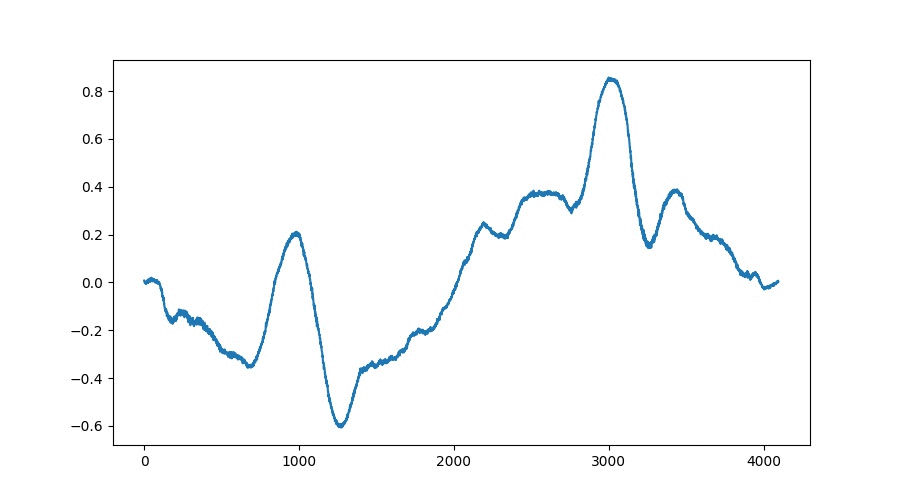

# A Data-Driven Approach to Wavetable-Synthesis
This Thesis investigates the application of a generative adversarial network (GAN) in the generation process of 
single-cycle wavetables, which can be played back via a proposed oscillator-framework. 
Classical wavetable synthesis approaches which allow the user to create wavetbales from their own sounds often lack an 
automatic processing step to properly align successive wavetables. 
When interpolating between two adjacent tables phase cancellation could occur which results in sound artifacts during playback.

The goal of the developed TableGAN architecture which is based on both, WaveGAN[1] and DCGAN[2], 
is to generate a stack of wavetables which represent interpolations between two given points whithin the learnt latent 
space of the network. The resulting wavetables show high correlations between their predecessors which results in smooth
interpolations without artifacts. The following GIF shows an exemplary interpolation:

## Contributions
- A classical wavetable-synthesis framework for extracting wavetables from audio files
- An AI based wavetable-synthesis framework for interpolating the latent space of a trained TableGAN model
- A wavetable-oscillator framework for playback and automation of the wavetable-position

## Thesis
[Creative-Technologies](http://www.creative-technologies.de/a-data-driven-ap…etable-synthesis/)

## Literature
[1] Chris Donahue, Julian J. McAuley, and Miller Puckette. “Adversarial Audio Synthesis”. In: ICLR. 2018.

[2] Alec Radford, Luke Metz, and Soumith Chintala. “Unsupervised Representation Learning with Deep Convolutional Generative Adversarial Networks”. In: CoRR abs/1511.06434 (2015).

## Author
*Niklas Wantrupp 2019* 